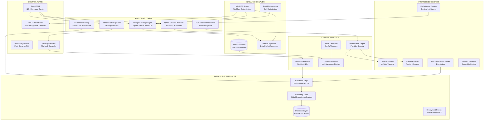
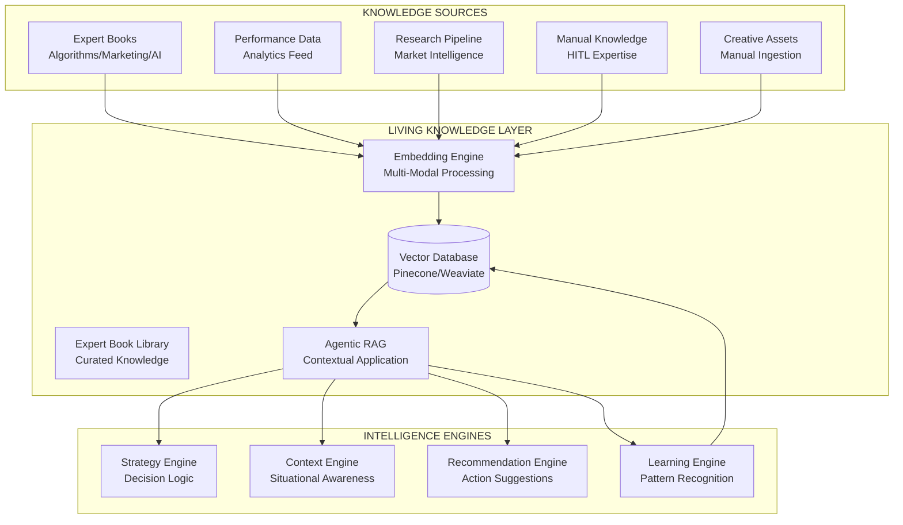
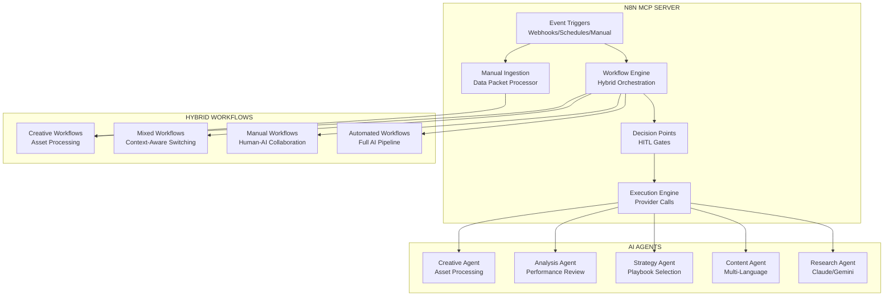
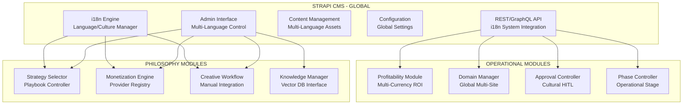
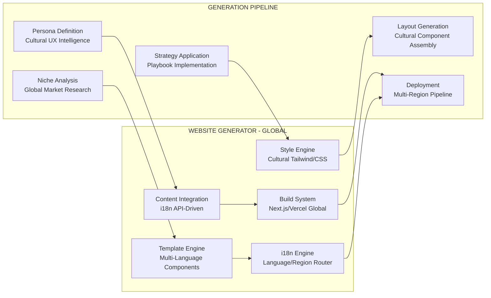
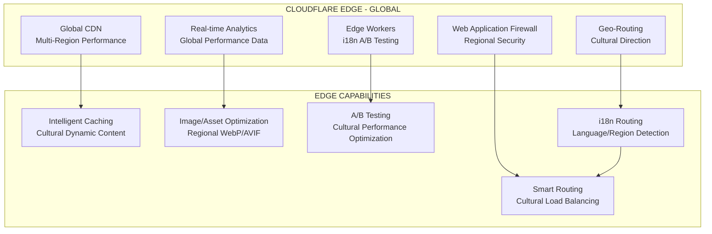
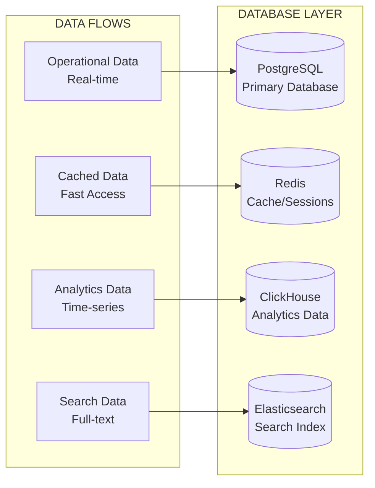
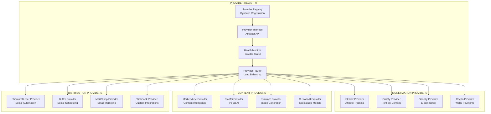
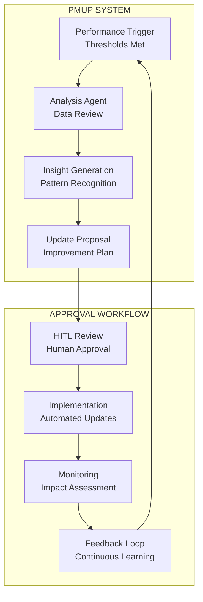
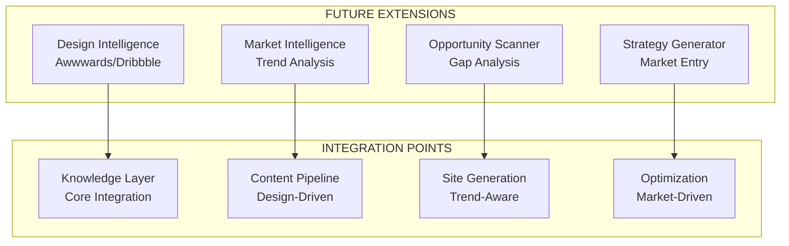

# 🏛️ MASTER SYSTEM BLUEPRINT V1.0
## Wolf Media Multi-Domain Empire - The Final Architecture

*Single Source of Truth - The Definitive Blueprint*

---

## 🎯 EXECUTIVE SUMMARY

This blueprint defines the complete, holistic architecture for the Wolf Media multi-domain empire - a truly scalable system capable of growing from 1 to 1000+ websites while embodying five core operational philosophies that make it a living, adaptive, and globally-aware business intelligence system.

**Core Philosophy**: A foundational architecture that natively embeds expert knowledge, creative workflows, adaptive strategies, multi-vector monetization, and borderless scaling from the ground up.

---

## 🧬 THE FIVE CORE OPERATIONAL PHILOSOPHIES

### 1. **The "Living" Knowledge Layer**
An expert system using Agentic RAG with vector databases to contextually apply principles from expert books on algorithms, marketing, AI, and domain expertise.

### 2. **The "Hybrid" Creative Workflow**
A creative factory with manual intervention capabilities, supporting data packet ingestion (folders with images, text, instructions.md) into automated workflows.

### 3. **The "Adaptive" Strategy Core**
A flexible strategic approach with a Strategy Selector that chooses and executes different primary playbooks (Social-First, Product-First, Niche-First) per project.

### 4. **The "Multi-Vector" Monetization Engine**
An abstract monetization system supporting diverse revenue streams through pluggable providers (Affiliate, Print-on-Demand, Prompt Selling, etc.).

### 5. **The "Borderless" Scaling Architecture**
Global-scale architecture with native internationalization (i18n) support across all components for cultural adaptation and worldwide deployment.

---

## 📊 SYSTEM OVERVIEW



---

## 🏗️ CORE ARCHITECTURAL PRINCIPLES

### 1. **PHILOSOPHY-DRIVEN ARCHITECTURE**
- All five core philosophies are embedded at the foundational level
- Architecture decisions flow from operational philosophies
- Native support for expert knowledge, creative workflows, adaptive strategies
- Multi-vector monetization and borderless scaling built-in

### 2. **AGENTIC RAG INTELLIGENCE**
- Vector database as the core intelligence foundation
- Contextual application of expert knowledge from curated book libraries
- Self-improving knowledge base through continuous learning
- Multi-modal knowledge representation (text, images, structured data)

### 3. **GLOBAL-FIRST DESIGN**
- Native i18n support in every component
- Cultural adaptation capabilities
- Multi-currency and multi-market awareness
- Geo-distributed deployment architecture

### 4. **PROVIDER-BASED EXTENSIBILITY**
- Pluggable provider system for all external integrations
- Abstract interfaces for monetization, content, and distribution
- Hot-swappable providers without system downtime
- Community-driven provider ecosystem

### 5. **HYBRID AUTOMATION**
- Balance between full automation and human creativity
- Manual ingestion paths for creative input
- Configurable automation levels per workflow
- Context-aware decision making for human intervention

---

## 🧠 INTELLIGENCE LAYER ARCHITECTURE

### **The "Living" Knowledge Layer (Agentic RAG System)**


**Living Knowledge Layer Components:**
- **Vector Database**: Core intelligence storage with semantic search capabilities
- **Expert Book Library**: Curated knowledge from domain experts (algorithms, marketing, AI)
- **Agentic RAG**: Contextual application of knowledge based on current situation
- **Multi-Modal Processing**: Support for text, images, structured data, and creative assets
- **Learning Engine**: Continuous improvement through performance feedback

### **n8n MCP Server (Hybrid Workflow Orchestration)**


### **Manual Ingestion System (Creative Data Packets)**
```yaml
# Manual ingestion workflow for creative inputs
manual_ingestion:
  data_packet_structure:
    - images/: "Visual assets (logos, photos, graphics)"
    - text/: "Copy, descriptions, brand guidelines"
    - instructions.md: "Specific processing instructions"
    - metadata.json: "Structured data, tags, categories"
    - context/: "Background information, inspiration"
  
  processing_pipeline:
    - validation: "Check packet structure and completeness"
    - extraction: "Extract and process all asset types"
    - embedding: "Generate embeddings for vector storage"
    - classification: "Categorize and tag assets"
    - integration: "Merge with automated workflows"
  
  output_integration:
    - knowledge_layer: "Add to vector database"
    - template_library: "Create reusable patterns"
    - content_pipeline: "Feed into generation workflows"
    - strategy_engine: "Inform decision making"
```

---

## 🎛️ CONTROL PLANE ARCHITECTURE

### **Strapi CMS (Global Command Center)**


### **Strategy Selector (Adaptive Strategy Core)**
```yaml
# Adaptive strategy system with playbook selection
strategy_selector:
  playbook_types:
    social_first:
      focus: "Social media virality and engagement"
      platforms: ["TikTok", "Instagram", "YouTube"]
      content_strategy: "Short-form, viral-optimized content"
      monetization: "Affiliate links, sponsored content"
      metrics: "Engagement rate, viral coefficient"
    
    product_first:
      focus: "Digital product creation and sales"
      platforms: ["Website", "Landing pages", "Email"]
      content_strategy: "Educational, problem-solving content"
      monetization: "Direct sales, upsells, subscriptions"
      metrics: "Conversion rate, customer LTV"
    
    niche_first:
      focus: "Niche domination and authority building"
      platforms: ["SEO-optimized sites", "Communities"]
      content_strategy: "Deep, authoritative content"
      monetization: "Affiliate, consulting, courses"
      metrics: "Search rankings, authority score"
    
    hybrid_approach:
      focus: "Multi-channel integrated strategy"
      platforms: ["All channels", "Cross-platform"]
      content_strategy: "Adaptive content strategy"
      monetization: "Multiple revenue streams"
      metrics: "Overall ROI, portfolio growth"
  
  selection_criteria:
    - niche_characteristics: "Market size, competition, trends"
    - resource_availability: "Budget, team, time constraints"
    - performance_history: "Past success patterns"
    - market_opportunities: "Current gaps and trends"
    - cultural_context: "Local market preferences"
  
  execution_framework:
    - strategy_selection: "AI-powered playbook recommendation"
    - customization: "Adapt playbook to specific context"
    - implementation: "Execute through n8n workflows"
    - monitoring: "Track performance against strategy KPIs"
    - optimization: "Continuous strategy refinement"
```

### **Multi-Vector Monetization Engine**
```yaml
# Abstract monetization system with pluggable providers
monetization_engine:
  provider_registry:
    affiliate_providers:
      - strackr: "Centralized affiliate tracking"
      - impact: "Enterprise affiliate platform"
      - cj_affiliate: "Commission Junction"
      - custom_networks: "Niche-specific programs"
    
    product_providers:
      - printify: "Print-on-demand products"
      - shopify: "E-commerce platform"
      - gumroad: "Digital product sales"
      - teachable: "Course platform"
    
    service_providers:
      - stripe: "Payment processing"
      - paypal: "Global payments"
      - wise: "International transfers"
      - crypto_gateways: "Cryptocurrency payments"
    
    content_providers:
      - prompt_libraries: "AI prompt marketplaces"
      - template_sales: "Design template sales"
      - stock_media: "Photo/video licensing"
      - subscription_content: "Premium content access"
  
  provider_interface:
    - setup: "Automated provider configuration"
    - tracking: "Revenue and performance monitoring"
    - optimization: "A/B testing of monetization strategies"
    - reporting: "Unified revenue dashboard"
    - scaling: "Auto-scaling successful monetization"
  
  revenue_optimization:
    - multi_stream: "Diversified revenue sources per domain"
    - cross_selling: "Related product recommendations"
    - upselling: "Premium offering promotion"
    - seasonal_adaptation: "Time-based monetization strategies"
    - cultural_adaptation: "Region-specific monetization"
```

### **Profitability Module (Multi-Currency Economic Intelligence)**
```yaml
# Global ROI tracking with multi-currency support
profitability_module:
  cost_tracking:
    - api_usage: "Real-time API cost monitoring (multi-currency)"
    - hosting_costs: "Infrastructure expense tracking (global)"
    - tool_subscriptions: "SaaS cost allocation (per region)"
    - human_time: "HITL intervention costs (timezone-aware)"
    - currency_conversion: "Real-time exchange rate tracking"
  
  revenue_tracking:
    - affiliate_commissions: "Multi-provider integration"
    - product_sales: "Direct revenue tracking (global)"
    - lead_generation: "CPA/CPL tracking (region-specific)"
    - subscription_revenue: "Recurring income (multi-currency)"
    - crypto_revenue: "Cryptocurrency income tracking"
  
  roi_calculation:
    - domain_level: "Individual site profitability (local currency)"
    - niche_level: "Category performance (normalized)"
    - campaign_level: "Marketing ROI (conversion-adjusted)"
    - regional_level: "Geographic performance comparison"
    - overall_portfolio: "Total empire performance (consolidated)"
  
  optimization_recommendations:
    - cost_reduction: "Automated cost-saving suggestions"
    - revenue_enhancement: "Growth opportunity identification"
    - resource_reallocation: "Performance-based redistribution"
    - currency_hedging: "Exchange rate risk mitigation"
    - regional_expansion: "Market opportunity prioritization"
```

### **HITL-AP Controller (Cultural Approval Gateway)**
```yaml
# Configurable approval thresholds with cultural awareness
hitl_ap_config:
  approval_thresholds:
    budget_limits:
      - low_threshold: "$50 (auto-approve)"
      - medium_threshold: "$200 (batch review)"
      - high_threshold: "$500 (individual review)"
      - currency_adaptation: "Threshold adjustment by region"
    
    quality_scores:
      - auto_approve: ">85% (validated patterns)"
      - review_required: "70-85% (cultural check)"
      - manual_approval: "<70% (full human review)"
    
    risk_levels:
      - low_risk: "Template-based, proven patterns"
      - medium_risk: "Modified templates, new niches"
      - high_risk: "Experimental strategies, new markets"
      - cultural_risk: "Content requiring cultural sensitivity"
  
  cultural_considerations:
    - language_sensitivity: "Content appropriateness check"
    - cultural_norms: "Local custom compliance"
    - legal_requirements: "Regional regulation compliance"
    - market_preferences: "Local market adaptation"
  
  approval_workflows:
    - immediate: "Auto-approve within thresholds"
    - batched: "Group similar decisions for efficiency"
    - escalated: "Human review for complex decisions"
    - cultural: "Cultural expert review for sensitive content"
    - emergency: "Fast-track for critical issues"
```

### **Phase Controller (Operational Intelligence)**
```yaml
# Phase-aware system behavior
phase_controller:
  phase_1_sandbox:
    domain_range: "1-20"
    focus: "Data gathering, A/B testing"
    automation_level: "60%"
    human_oversight: "High"
    features_enabled:
      - experimental_strategies
      - extensive_logging
      - manual_review_gates
  
  phase_2_growth:
    domain_range: "21-100"
    focus: "Scaling validated strategies"
    automation_level: "80%"
    human_oversight: "Medium"
    features_enabled:
      - proven_pattern_automation
      - performance_optimization
      - selective_human_review
  
  phase_3_scale:
    domain_range: "101+"
    focus: "Efficiency and expansion"
    automation_level: "95%"
    human_oversight: "Low"
    features_enabled:
      - full_automation
      - predictive_scaling
      - exception_based_review
```

---

## 🏭 GENERATION LAYER ARCHITECTURE

### **Website Generator (Global Next.js Engine)**


### **Borderless Scaling Architecture**
```yaml
# Global deployment with cultural adaptation
borderless_architecture:
  i18n_foundation:
    language_support:
      - primary_languages: ["English", "Spanish", "German", "French"]
      - secondary_languages: ["Italian", "Portuguese", "Dutch"]
      - ai_translation: "Automated content translation"
      - cultural_adaptation: "Local market customization"
    
    content_localization:
      - text_translation: "AI-powered translation with human review"
      - image_localization: "Culture-specific visual content"
      - currency_display: "Local currency and payment methods"
      - date_time_formats: "Regional date/time preferences"
    
    regional_deployment:
      - geo_routing: "Cloudflare edge routing by region"
      - cdn_optimization: "Regional content delivery"
      - data_sovereignty: "Regional data storage compliance"
      - performance_optimization: "Region-specific caching"
  
  cultural_intelligence:
    market_adaptation:
      - color_psychology: "Cultural color preference adaptation"
      - layout_preferences: "Regional UX pattern preferences"
      - content_style: "Cultural communication style adaptation"
      - social_proof: "Local testimonial and review integration"
    
    compliance_framework:
      - gdpr_compliance: "European data protection"
      - ccpa_compliance: "California consumer privacy"
      - regional_regulations: "Local marketing and business laws"
      - cultural_sensitivity: "Religious and cultural respect"
  
  scaling_infrastructure:
    multi_region_deployment:
      - primary_regions: ["US-East", "EU-West", "Asia-Pacific"]
      - secondary_regions: ["US-West", "EU-Central", "Asia-Southeast"]
      - failover_regions: "Disaster recovery and backup"
      - edge_computing: "Global edge worker deployment"
    
    performance_optimization:
      - regional_caching: "Content delivery optimization"
      - database_sharding: "Regional data distribution"
      - load_balancing: "Traffic distribution optimization"
      - auto_scaling: "Demand-based resource allocation"
```

### **Content Generator (Multi-Language AI Pipeline)**
```yaml
# Multi-stage content generation with global awareness
content_pipeline:
  research_stage:
    - keyword_research: "SEO-driven topic identification (multi-language)"
    - competitor_analysis: "Content gap analysis (regional)"
    - trend_analysis: "Viral potential assessment (cultural)"
    - audience_research: "Persona-specific insights (cultural adaptation)"
    - vector_knowledge: "Agentic RAG expert knowledge application"
  
  generation_stage:
    - outline_creation: "Structured content planning (strategy-aware)"
    - content_writing: "AI-generated articles/copy (multi-language)"
    - visual_creation: "Clarifai/Runware integration (cultural-aware)"
    - seo_optimization: "MarketMuse integration (regional SEO)"
    - translation_optimization: "Multi-language content adaptation"
  
  quality_stage:
    - fact_checking: "Automated accuracy validation"
    - readability_analysis: "Audience-appropriate language (cultural)"
    - seo_scoring: "Technical optimization (regional)"
    - brand_alignment: "Consistency verification (global brand)"
    - cultural_sensitivity: "Cultural appropriateness check"
  
  distribution_stage:
    - multi_channel: "PhantomBuster integration (platform-specific)"
    - social_media: "Platform-specific formatting (cultural adaptation)"
    - email_marketing: "Newsletter integration (regional preferences)"
    - cross_promotion: "Internal linking strategy (language-aware)"
    - monetization_integration: "Provider-specific content optimization"
  
  creative_integration:
    - manual_assets: "Creative data packet integration"
    - brand_consistency: "Manual brand element application"
    - custom_instructions: "instructions.md workflow integration"
    - hybrid_workflows: "Human-AI collaborative content creation"
```

---

## 🔧 INFRASTRUCTURE LAYER ARCHITECTURE

### **Cloudflare Edge (Global Performance + Security)**


### **Global Infrastructure Management**
```yaml
# Multi-region infrastructure with cultural awareness
global_infrastructure:
  edge_computing:
    cloudflare_workers:
      - i18n_routing: "Automatic language/region detection"
      - cultural_adaptation: "Real-time content adaptation"
      - performance_optimization: "Regional caching strategies"
      - a_b_testing: "Cultural A/B testing frameworks"
    
    regional_deployment:
      - primary_pops: "Major population centers"
      - secondary_pops: "Regional coverage expansion"
      - failover_routing: "Disaster recovery routing"
      - performance_monitoring: "Real-time global performance"
  
  database_architecture:
    multi_master_setup:
      - primary_regions: "US-East, EU-West, Asia-Pacific"
      - read_replicas: "Regional read optimization"
      - write_optimization: "Closest master routing"
      - conflict_resolution: "Multi-master conflict handling"
    
    data_sovereignty:
      - regional_compliance: "Local data storage requirements"
      - cross_border_controls: "Data transfer restrictions"
      - backup_strategies: "Regional backup and recovery"
      - audit_trails: "Compliance audit logging"
  
  monitoring_observability:
    global_monitoring:
      - performance_tracking: "Regional performance metrics"
      - error_aggregation: "Global error tracking"
      - business_metrics: "Revenue and conversion tracking"
      - cultural_analytics: "Regional behavior analysis"
    
    alerting_escalation:
      - regional_alerts: "Local issue detection"
      - global_alerts: "Empire-wide issue detection"
      - escalation_paths: "Regional team notification"
      - cultural_context: "Local market impact assessment"
```

### **Monitoring Stack (System Health)**
```yaml
# Comprehensive monitoring setup
monitoring_stack:
  prometheus:
    - system_metrics: "CPU, Memory, Disk, Network"
    - application_metrics: "Response times, error rates"
    - business_metrics: "Conversion rates, revenue"
    - custom_metrics: "Domain-specific KPIs"
  
  grafana:
    - system_dashboards: "Infrastructure health"
    - application_dashboards: "Performance metrics"
    - business_dashboards: "ROI and profitability"
    - alert_dashboards: "Real-time issue tracking"
  
  alerting:
    - critical_alerts: "System downtime, security breaches"
    - warning_alerts: "Performance degradation"
    - business_alerts: "Revenue drops, ROI changes"
    - custom_alerts: "Domain-specific thresholds"
```

### **Database Layer (Data Management)**


---

## 🔌 PROVIDER ECOSYSTEM

### **Provider Architecture (Pluggable Integrations)**


### **Provider Integration Framework**
```yaml
# Pluggable provider system with hot-swapping capabilities
provider_framework:
  provider_interface:
    standard_methods:
      - initialize: "Provider setup and authentication"
      - execute: "Primary provider functionality"
      - status: "Health check and status reporting"
      - metrics: "Performance and usage metrics"
      - cleanup: "Graceful shutdown and cleanup"
    
    configuration:
      - credentials: "Secure credential management"
      - settings: "Provider-specific configuration"
      - limits: "Rate limiting and usage quotas"
      - fallbacks: "Backup provider configuration"
    
    monitoring:
      - performance_tracking: "Response time and success rate"
      - error_handling: "Comprehensive error management"
      - usage_analytics: "Provider utilization statistics"
      - cost_tracking: "Provider cost monitoring"
  
  provider_registry:
    dynamic_registration:
      - auto_discovery: "Automatic provider detection"
      - hot_swapping: "Runtime provider replacement"
      - version_management: "Provider version control"
      - dependency_resolution: "Provider dependency management"
    
    load_balancing:
      - round_robin: "Distribute load across providers"
      - weighted_routing: "Performance-based routing"
      - failover: "Automatic failover to backup providers"
      - circuit_breaker: "Provider failure protection"
  
  extensibility:
    custom_providers:
      - provider_sdk: "Software development kit for custom providers"
      - template_providers: "Boilerplate provider templates"
      - community_marketplace: "Community provider sharing"
      - approval_process: "Quality assurance for community providers"
    
    integration_patterns:
      - webhook_providers: "Event-driven integrations"
      - api_providers: "REST/GraphQL API integrations"
      - file_providers: "File-based integrations"
      - stream_providers: "Real-time data stream integrations"
```

### **Global Provider Ecosystem**
```yaml
# Regional provider support and cultural adaptation
global_provider_ecosystem:
  regional_providers:
    payment_providers:
      - north_america: ["Stripe", "PayPal", "Square"]
      - europe: ["Stripe", "PayPal", "Klarna", "SEPA"]
      - asia_pacific: ["Alipay", "WeChat Pay", "PayPal"]
      - latin_america: ["PayPal", "MercadoPago", "PIX"]
    
    affiliate_networks:
      - global: ["Impact", "CJ Affiliate", "ShareASale"]
      - regional: ["Awin (EU)", "Rakuten (Asia)", "PartnerizeUS"]
      - local: ["Regional affiliate networks per country"]
    
    social_platforms:
      - global: ["Facebook", "Instagram", "Twitter", "LinkedIn"]
      - regional: ["WeChat (China)", "LINE (Japan)", "VK (Russia)"]
      - emerging: ["TikTok", "Clubhouse", "Discord"]
  
  cultural_adaptation:
    provider_selection:
      - market_preferences: "Local platform popularity"
      - regulatory_compliance: "Regional regulation adherence"
      - payment_methods: "Preferred local payment options"
      - social_behaviors: "Cultural social media usage patterns"
    
    content_providers:
      - translation_services: "Regional translation providers"
      - cultural_consultants: "Local market expertise"
      - legal_compliance: "Regional legal requirement providers"
      - market_research: "Local market intelligence providers"
```

---

## 🔄 SELF-OPTIMIZATION ARCHITECTURE

### **Post-Mortem & Update Protocol (PMUP)**


### **Learning Loop Architecture**
```yaml
# Continuous improvement system
learning_loop:
  data_collection:
    - performance_metrics: "Real-time system performance"
    - user_behavior: "Analytics and engagement data"
    - business_outcomes: "Revenue and conversion data"
    - market_feedback: "External market intelligence"
  
  pattern_recognition:
    - success_patterns: "High-performing strategies"
    - failure_patterns: "Underperforming approaches"
    - market_trends: "Emerging opportunities"
    - optimization_opportunities: "Improvement areas"
  
  knowledge_updates:
    - template_refinement: "Proven pattern updates"
    - strategy_evolution: "Decision logic improvements"
    - process_optimization: "Workflow enhancements"
    - capability_expansion: "New feature development"
  
  implementation_cycle:
    - hypothesis_generation: "Improvement theories"
    - a_b_testing: "Controlled experimentation"
    - performance_validation: "Results verification"
    - rollout_decision: "Scaled implementation"
```

---

## 🚀 FUTURE EXTENSIBILITY

### **Design & Market Opportunity Intelligence Layer**


### **Extension Architecture**
```yaml
# Future capability extensions
extension_framework:
  design_intelligence:
    - trend_analysis: "Awwwards/Dribbble monitoring"
    - design_pattern_extraction: "Visual pattern recognition"
    - aesthetic_trend_prediction: "Design trend forecasting"
    - competitive_design_analysis: "Visual differentiation"
  
  market_intelligence:
    - niche_discovery: "Low-competition identification"
    - trend_prediction: "Market movement forecasting"
    - opportunity_scoring: "Business potential assessment"
    - timing_optimization: "Market entry timing"
  
  capability_expansion:
    - voice_content: "Podcast/audio generation"
    - video_content: "Automated video creation"
    - interactive_content: "Dynamic user experiences"
    - personalization_engine: "AI-driven customization"
```

---

## 📊 IMPLEMENTATION ROADMAP

### **Phase 1: Philosophy Foundation (Months 1-3)**
- [ ] **Living Knowledge Layer**: Vector database setup (Pinecone/Weaviate)
- [ ] **Agentic RAG System**: Expert book library integration
- [ ] **Strategy Selector**: Playbook framework implementation  
- [ ] **Strapi CMS**: Global i18n command center setup
- [ ] **Provider Registry**: Abstract provider interface design
- [ ] **Manual Ingestion**: Creative data packet processor
- [ ] **Multi-Currency**: Profitability module foundation

### **Phase 2: Global Intelligence (Months 4-6)**
- [ ] **Borderless Architecture**: Multi-region deployment pipeline
- [ ] **Cultural HITL-AP**: Regional approval gateway
- [ ] **Multi-Vector Monetization**: Provider ecosystem implementation
- [ ] **Global Analytics**: Multi-region performance tracking
- [ ] **Provider Integrations**: Strackr, Printify, MarketMuse providers
- [ ] **n8n Hybrid Workflows**: Manual + automated orchestration
- [ ] **i18n Content Pipeline**: Multi-language content generation

### **Phase 3: Adaptive Optimization (Months 7-9)**
- [ ] **PMUP System**: Self-optimization with cultural awareness
- [ ] **Advanced Agentic RAG**: Expert knowledge contextual application
- [ ] **Cultural A/B Testing**: Regional performance optimization
- [ ] **Hybrid Creative Workflows**: Human-AI collaboration refinement
- [ ] **Global Monitoring**: Cross-cultural performance tracking
- [ ] **Provider Ecosystem**: Hot-swappable provider marketplace
- [ ] **Strategy Evolution**: Adaptive playbook refinement

### **Phase 4: Empire Scale (Months 10-12)**
- [ ] **1000+ Domain Management**: Automated global deployment
- [ ] **Cultural Intelligence**: Advanced regional adaptation
- [ ] **Provider Marketplace**: Community-driven provider ecosystem
- [ ] **Advanced Monetization**: Cross-cultural revenue optimization
- [ ] **Global Orchestration**: Multi-region AI coordination
- [ ] **Knowledge Evolution**: Continuous expert system improvement
- [ ] **Philosophy Integration**: Full operational philosophy embodiment

### **Philosophy Integration Milestones**
```yaml
philosophy_milestones:
  living_knowledge:
    month_1: "Vector database operational"
    month_3: "Expert book library integrated"
    month_6: "Agentic RAG fully functional"
    month_12: "Self-evolving knowledge system"
  
  hybrid_creative:
    month_2: "Manual ingestion working"
    month_4: "Creative workflow integration"
    month_7: "Human-AI collaboration optimized"
    month_12: "Seamless creative factory"
  
  adaptive_strategy:
    month_1: "Strategy selector framework"
    month_3: "All playbooks implemented"
    month_6: "Cultural strategy adaptation"
    month_12: "Predictive strategy evolution"
  
  multi_vector_monetization:
    month_2: "Provider registry operational"
    month_4: "Core providers integrated"
    month_8: "Global provider ecosystem"
    month_12: "Autonomous monetization optimization"
  
  borderless_scaling:
    month_3: "Multi-region infrastructure"
    month_6: "Cultural intelligence operational"
    month_9: "Global optimization systems"
    month_12: "Autonomous global expansion"
```

---

## 🎯 SUCCESS METRICS

### **Philosophy Implementation KPIs**
- **Living Knowledge Utilization**: > 80% of decisions use Agentic RAG
- **Creative Workflow Integration**: > 60% hybrid workflows operational
- **Strategy Adaptation**: > 75% culturally appropriate strategy selection
- **Monetization Diversification**: > 3 active revenue streams per domain
- **Global Deployment**: > 5 active regions with cultural adaptation

### **System Performance KPIs**
- **Multi-Region Deployment**: < 10 minutes per new global domain
- **Global Uptime**: > 99.9% availability across all regions
- **Cultural Performance**: < 2s load times globally + cultural UX adaptation
- **Hybrid Automation**: > 85% automated with 15% creative human input
- **Provider Resilience**: < 30s failover time between providers

### **Business Performance KPIs**
- **Global ROI**: > 300% within 6 months per domain (currency-adjusted)
- **Regional Cost Efficiency**: < $25/month per domain (regional average)
- **Multi-Vector Revenue**: 25% month-over-month across all streams
- **Cultural Penetration**: 1000+ domains across 5+ cultural markets
- **Provider Ecosystem Value**: > 20 active providers in marketplace

### **Intelligence & Adaptation KPIs**
- **Cultural Prediction Accuracy**: > 85% for regional market trends
- **Agentic RAG Impact**: > 30% improvement in decision quality
- **Creative Integration Success**: > 70% manual assets successfully integrated
- **Strategy Evolution Speed**: < 48h adaptation to market changes
- **Knowledge System Growth**: > 50% knowledge base expansion annually

### **Global Empire KPIs**
- **Market Penetration**: Active presence in 10+ countries
- **Cultural Compliance**: 100% regional regulation adherence
- **Multi-Language Performance**: 90%+ quality across all languages
- **Provider Ecosystem Health**: > 95% provider uptime
- **Revenue Stream Diversity**: < 40% dependency on any single stream

---

## 🔒 SECURITY & COMPLIANCE

### **Security Framework**
- **API Security**: OAuth 2.0, JWT tokens, rate limiting
- **Data Protection**: Encryption at rest and in transit
- **Access Control**: Role-based permissions, audit trails
- **Monitoring**: Real-time security monitoring, threat detection

### **Compliance Requirements**
- **GDPR**: Data privacy, consent management
- **CCPA**: California privacy compliance
- **SOC 2**: Security and availability standards
- **PCI DSS**: Payment processing security

---

## 📝 CONCLUSION

This Master System Blueprint V1.0 represents the definitive, comprehensive architecture for the Wolf Media multi-domain empire - a truly revolutionary system that embodies the five core operational philosophies at its foundation.

**The Five Philosophy Integration:**

1. **Living Knowledge Layer**: The system becomes a true expert through Agentic RAG, contextually applying knowledge from curated expert libraries to every decision.

2. **Hybrid Creative Workflow**: Perfect balance between automation and human creativity, with seamless manual ingestion paths for creative assets and instructions.

3. **Adaptive Strategy Core**: Intelligent strategy selection that adapts to niche characteristics, cultural context, and market opportunities through multiple proven playbooks.

4. **Multi-Vector Monetization Engine**: Abstract, pluggable provider system supporting diverse revenue streams from affiliate marketing to print-on-demand to digital products.

5. **Borderless Scaling Architecture**: Native internationalization with cultural intelligence, enabling true global expansion with local market adaptation.

**Architectural Excellence:**
- **Philosophy-Driven Design**: Every component embeds the five core philosophies
- **Global Intelligence**: Multi-region, culturally-aware decision making
- **Provider Ecosystem**: Extensible, hot-swappable integration framework
- **Hybrid Automation**: Human-AI collaboration at the optimal balance
- **Cultural Adaptation**: True global scale with local market respect

**Transformational Capabilities:**
- **1000+ Domain Management**: Automated global deployment and management
- **Cultural Intelligence**: Regional adaptation and compliance
- **Expert Knowledge Application**: Contextual decision making from expert sources
- **Creative Factory Operations**: Seamless human-AI content collaboration
- **Revenue Stream Optimization**: Multi-vector monetization across cultures

This blueprint transcends traditional system architecture by embedding operational philosophies into the technical foundation, creating a living, adaptive, and globally-aware digital empire capable of true borderless scaling.

**This is our Single Source of Truth - The Final Architecture.**

---

*Document Version: 1.0 - The Final Blueprint*  
*Last Updated: 2025-07-05*  
*Status: Definitive Master Architecture - Philosophy Integrated - Implementation Ready*  
*Philosophy Integration: Complete*