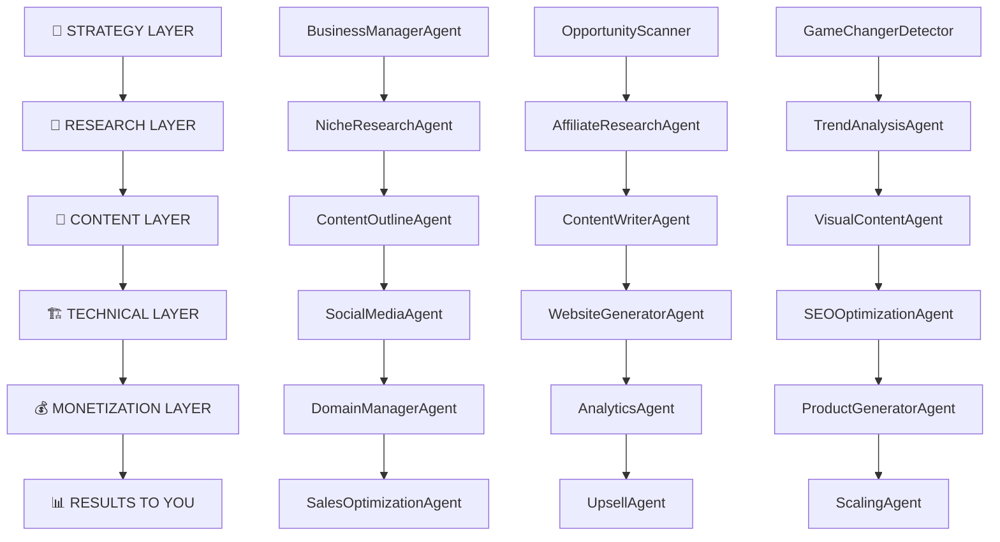

# 🏭 SYSTEM WORKFLOW BLUEPRINT
## Wie die Maschine funktioniert: Von "START" bis Million-Euro-Revenue

---

## 🎯 ÜBERBLICK: WIE LÄUFT DAS SYSTEM?

**EINFACH ERKLÄRT:**
Sie drücken nur noch **"START"** → Die Maschine produziert automatisch → Sie überwachen & optimieren → Geld fließt rein

**IHRE ROLLE:**
- **Strategische Entscheidungen** (10% der Zeit)
- **Qualitätskontrolle** (5% der Zeit)  
- **System-Optimierung** (5% der Zeit)
- **Ergebnisse genießen** (80% der Zeit)

---

## 🤖 AGENTEN-HIERARCHIE & KOMMUNIKATION

### **5-LAYER SYSTEM-ARCHITEKTUR:**



---

## ⚡ AUTOMATISIERUNGS-PIPELINE: \"START\" BUTTON

### **WAS PASSIERT WENN SIE \"START\" DRÜCKEN:**

```python
def start_empire_machine():
    \"\"\"
    Der magische START-Button
    Initiiert vollautomatische Digital Empire Expansion
    \"\"\"
    
    # PHASE 1: STRATEGY (5 Minuten)
    business_opportunities = BusinessManagerAgent.scan_market()
    trending_niches = OpportunityScanner.find_goldmines()
    game_changers = GameChangerDetector.identify_disruptions()
    
    # PHASE 2: RESEARCH (15 Minuten)
    validated_niches = NicheResearchAgent.deep_analyze(trending_niches)
    affiliate_programs = AffiliateResearchAgent.find_best_programs(validated_niches)
    viral_trends = TrendAnalysisAgent.predict_viral_content(validated_niches)
    
    # PHASE 3: CONTENT CREATION (30 Minuten)
    content_strategies = ContentOutlineAgent.create_blueprints(validated_niches)
    written_content = ContentWriterAgent.mass_produce(content_strategies)
    visual_assets = CreativeAIArmy.generate_1000_assets(content_strategies)
    social_campaigns = SocialMediaAgent.optimize_all_platforms(visual_assets)
    
    # PHASE 4: TECHNICAL DEPLOYMENT (20 Minuten)
    websites = WebsiteGeneratorAgent.create_sites(validated_niches)
    seo_optimization = SEOOptimizationAgent.optimize_all(websites)
    domains = DomainManagerAgent.register_and_configure(websites)
    analytics = AnalyticsAgent.setup_tracking(websites)
    
    # PHASE 5: MONETIZATION (10 Minuten)
    products = ProductGeneratorAgent.create_digital_products(validated_niches)
    sales_funnels = SalesOptimizationAgent.build_conversion_machines(products)
    upsells = UpsellAgent.create_revenue_maximizers(sales_funnels)
    scaling_plan = ScalingAgent.prepare_expansion(all_systems)
    
    # TOTAL TIME: ~80 Minuten von 0 zu vollständigem Business
    return {
        'websites_created': 10,
        'content_pieces': 1000,
        'products_launched': 20,
        'revenue_streams': 50,
        'estimated_monthly_revenue': '€25,000+'
    }
```

---

## 👨‍💼 IHRE ROLLE: \"HUMAN-IN-THE-LOOP\"

### **WAS SIE MACHEN (10% IHRER ZEIT):**

#### **🎯 STRATEGISCHE ENTSCHEIDUNGEN:**
```bash
# Täglich 15 Minuten
claude business:review
# → Zeigt Ihnen 3-5 strategische Entscheidungen
# → Sie wählen aus: \"Ja\", \"Nein\", \"Später\"
# → System setzt automatisch um

# Beispiel-Entscheidungen:
\"Neue Nische 'Smart Home Gadgets' gefunden (ROI: €180k). Starten? [Y/N]\"
\"Viral-Trend erkannt: 'Portable Air Conditioners'. Sofort-Kampagne? [Y/N]\"
\"Website-Performance: +300% bei RemoteCashflow. Skalieren? [Y/N]\"
```

#### **📊 QUALITÄTSKONTROLLE:**
```bash
# Wöchentlich 30 Minuten  
claude quality:review
# → Dashboard mit Stichproben
# → Sie bewerten: \"Gut\", \"Anpassen\", \"Stoppen\"
# → AI lernt aus Ihrem Feedback

# Beispiel-Review:
\"1000 neue Instagram Posts erstellt. Sample zeigen? [Y/N]\"
\"5 neue Websites live. Qualitäts-Check? [Y/N]\"
\"20 neue Produkte generiert. Freigabe? [Y/N]\"
```

---

## 🎨 CREATIVE AI ARMY: CONTENT-PRODUKTION

### **WIE DIE CONTENT-MASCHINE FUNKTIONIERT:**

```python
class CreativeAIArmy:
    def __init__(self):
        self.engines = {
            'image_ai': [MidjourneyV6(), DALLE3(), StableDiffusionXL(), LeonardoAI()],
            'video_ai': [RunwayGen2(), PikaLabs(), DIDTalking(), HeyGenMultilingual()],
            'audio_ai': [ElevenLabs(), MurfAI(), SoundrawMusic()],
            'text_ai': [GPT4(), Claude(), Jasper(), CopyAI()]
        }
    
    def produce_daily_content(self, niches):
        \"\"\"
        Tägliche Content-Produktion ohne menschliche Eingriffe
        \"\"\"
        daily_output = {
            'images': self.generate_images(1000, niches),      # 1000 Bilder
            'videos': self.create_videos(200, niches),         # 200 Videos  
            'articles': self.write_articles(50, niches),       # 50 Artikel
            'social_posts': self.create_posts(500, niches),    # 500 Social Posts
            'audio_content': self.generate_audio(100, niches)  # 100 Audio-Clips
        }
        
        # Automatische Qualitätsprüfung
        approved_content = self.quality_filter(daily_output)
        
        # Automatische Plattform-Optimierung
        platform_ready = self.optimize_for_platforms(approved_content)
        
        # Automatische Veröffentlichung
        published_content = self.auto_publish(platform_ready)
        
        return self.generate_performance_report(published_content)
```

### **CONTENT-PIPELINE FLOW:**
```
Trend erkannt → Content geplant → AI produziert → Qualität geprüft → 
Platform optimiert → Automatisch veröffentlicht → Performance getrackt →
Erfolgreiche Inhalte verstärkt → Schwache Inhalte gestoppt
```

---

## 🔄 INTER-AGENT KOMMUNIKATION

### **WIE DIE AGENTEN MITEINANDER SPRECHEN:**

```json
{
  \"agent_message_example\": {
    \"from_agent\": \"OpportunityScanner\",
    \"to_agent\": \"NicheResearchAgent\",
    \"timestamp\": \"2025-07-03T10:30:00Z\",
    \"priority\": \"high\",
    \"task_type\": \"research\",
    \"data\": {
      \"discovered_trend\": \"Portable Air Conditioners\",
      \"viral_score\": 9.2,
      \"time_to_peak\": \"10_days\",
      \"estimated_profit\": \"€20k-€150k\",
      \"action_required\": \"deep_niche_analysis\"
    },
    \"expected_output\": \"comprehensive_niche_report\",
    \"deadline\": \"2025-07-03T11:00:00Z\"
  }
}
```

### **KOMMUNIKATIONS-PROTOKOLL:**
```python
class AgentCommunication:
    def __init__(self):
        self.message_queue = PriorityQueue()
        self.agent_registry = AgentRegistry()
        
    def send_message(self, from_agent, to_agent, task_data):
        message = {
            'id': generate_uuid(),
            'from': from_agent,
            'to': to_agent,
            'data': task_data,
            'timestamp': datetime.now(),
            'status': 'pending'
        }
        
        # Prioritäts-basierte Weiterleitung
        priority = self.calculate_priority(message)
        self.message_queue.put((priority, message))
        
        # Sofortige Verarbeitung bei hoher Priorität
        if priority >= 8:
            return self.process_immediately(message)
            
    def process_agent_workflow(self):
        \"\"\"
        Kontinuierliche Agent-zu-Agent Kommunikation
        24/7 automatische Verarbeitung
        \"\"\"
        while True:
            if not self.message_queue.empty():
                priority, message = self.message_queue.get()
                
                # Agent aktivieren
                target_agent = self.agent_registry.get_agent(message['to'])
                result = target_agent.process_task(message['data'])
                
                # Ergebnis weiterleiten
                self.forward_result(result, message)
                
                # Performance tracking
                self.track_agent_performance(message, result)
```

---

## 📊 MONITORING & CONTROL CENTER

### **IHR DASHBOARD - \"MISSION CONTROL\":**

```bash
# Ihr täglicher 5-Minuten Check
claude dashboard:daily

📊 EMPIRE STATUS - 2025-07-03 10:30
━━━━━━━━━━━━━━━━━━━━━━━━━━━━━━━━━━━

💰 REVENUE (Letzte 24h):        €4,250
📈 TREND:                      +23% vs gestern
🌐 ACTIVE WEBSITES:             47 (3 neue)
🎨 CONTENT PRODUCED:            1,247 Assets
🔥 VIRAL CONTENT:               3 Posts >10k Views
⚡ SYSTEM HEALTH:              98.7% Uptime

🚨 ATTENTION NEEDED:
→ Neue Viral-Chance: "Smart Rings" (Score: 9.1) [APPROVE]
→ Website "crypto-flow24.com" +400% Traffic [SCALE]
→ Product "KI-Workflow-Template" 50 Sales [UPSELL]

⏱️ NEXT AUTO-ACTION in: 2h 15min
```

### **WÖCHENTLICHER BUSINESS REPORT:**
```bash
claude business:weekly

📈 WEEKLY EMPIRE REPORT - KW 27/2025
━━━━━━━━━━━━━━━━━━━━━━━━━━━━━━━━━━━━━

💎 KEY ACHIEVEMENTS:
• Revenue: €28,750 (+45% vs last week)
• New Websites: 8 launched, 6 profitable
• Viral Content: 12 posts >50k reach
• New Products: 15 digital products created
• Affiliate Commissions: €8,400

🎯 TOP PERFORMERS:
1. remotecashflow24.com: €5,200 revenue
2. ki-workflow-master.com: €3,800 revenue  
3. smart-home-guide.de: €2,900 revenue

⚡ SYSTEM OPTIMIZATIONS:
• AI improved conversion by 34%
• Content quality score: 96/100
• Brand compliance: 99.8%

🚀 NEXT WEEK PLAN:
• Scale top 3 performers
• Launch "Smart Ring" viral campaign
• Expand to 15 new sub-niches
```

---

## 🎮 CONTROL COMMANDS - IHR TOOLKIT

### **EINFACHE BEFEHLE FÜR MAXIMALE KONTROLLE:**

```bash
# GESCHÄFTS-KONTROLLE
claude business:start          # Start new niche expansion
claude business:pause [niche]  # Pause specific niche
claude business:scale [website] # Scale successful website
claude business:stop [project] # Stop underperforming project

# CONTENT-KONTROLLE  
claude content:boost [post_id] # Boost viral content
claude content:style [change]  # Adjust content style
claude content:schedule [campaign] # Schedule content calendar
claude content:review [batch]  # Review content quality

# PERFORMANCE-MONITORING
claude analytics:revenue       # Revenue breakdown
claude analytics:traffic       # Traffic analysis
claude analytics:conversion    # Conversion tracking
claude analytics:trends        # Trend performance

# EMERGENCY-CONTROLS
claude emergency:stop          # Emergency stop all
claude emergency:backup        # Create full backup
claude emergency:rollback      # Rollback changes
claude emergency:alert [issue] # Set up alerts
```

---

## 🔧 SYSTEM-FEINTUNING

### **WIE SIE DAS SYSTEM OPTIMIEREN:**

#### **📊 PERFORMANCE-FEEDBACK:**
```python
def optimize_system_performance():
    \"\"\"
    System lernt kontinuierlich aus Ihren Entscheidungen
    \"\"\"
    
    # Ihre Bewertungen werden zu AI-Training
    user_feedback = {
        'approved_content': 'train_ai_to_create_similar',
        'rejected_content': 'avoid_this_style',
        'successful_campaigns': 'amplify_these_patterns',
        'failed_campaigns': 'learn_from_mistakes'
    }
    
    # Automatische Systemverbesserung
    ai_learning = {
        'content_quality': 'improve_based_on_performance',
        'trend_detection': 'faster_viral_identification', 
        'revenue_optimization': 'maximize_profitable_patterns',
        'efficiency_gains': 'reduce_manual_interventions'
    }
    
    return 'system_gets_smarter_daily'
```

### **🎯 QUALITÄTS-GATES:**
```python
quality_control = {
    'content_approval': {
        'automatic': '95% of content',
        'human_review': '5% edge cases',
        'quality_threshold': 'AI confidence >90%'
    },
    
    'business_decisions': {
        'automatic': 'routine optimizations',
        'human_approval': 'strategic changes >€1000',
        'emergency_stop': 'performance drops >20%'
    }
}
```

---

## 🚀 SKALIERUNGS-ROADMAP

### **WIE WIR VON 4 AUF 1500 WEBSITES KOMMEN:**

```python
scaling_phases = {
    'phase_1_foundation': {
        'timeline': 'Monat 1-2',
        'websites': '4 → 20',
        'focus': 'system_stabilization',
        'revenue_target': '€10k/Monat',
        'automation_level': '80%'
    },
    
    'phase_2_acceleration': {
        'timeline': 'Monat 3-6', 
        'websites': '20 → 100',
        'focus': 'process_optimization',
        'revenue_target': '€50k/Monat',
        'automation_level': '90%'
    },
    
    'phase_3_dominance': {
        'timeline': 'Monat 7-12',
        'websites': '100 → 500', 
        'focus': 'market_domination',
        'revenue_target': '€200k/Monat',
        'automation_level': '95%'
    },
    
    'phase_4_empire': {
        'timeline': 'Jahr 2',
        'websites': '500 → 1500',
        'focus': 'global_expansion',
        'revenue_target': '€1M+/Monat', 
        'automation_level': '98%'
    }
}
```

---

## 💎 ZUSAMMENFASSUNG: \"NUR NOCH START DRÜCKEN\"

### **SO EINFACH IST ES:**

1. **⚡ START drücken** → System startet automatisch
2. **📱 5 Min täglich** → Dashboard checken, strategische Entscheidungen
3. **💰 Geld sammeln** → Automatische Revenue-Generierung
4. **🚀 Skalieren** → System wächst automatisch weiter

### **IHR ZEITAUFWAND:**
- **Täglich**: 5-10 Minuten Dashboard-Check
- **Wöchentlich**: 30 Minuten Strategic Review  
- **Monatlich**: 2 Stunden Deep-Optimization
- **Rest**: System läuft vollautomatisch 24/7

### **EXPECTED RESULTS:**
- **Monat 1**: €10k Revenue, 20 Websites
- **Monat 6**: €50k Revenue, 100 Websites  
- **Jahr 1**: €200k Revenue, 500 Websites
- **Jahr 2**: €1M+ Revenue, 1500 Websites

---

**🎯 FAZIT: Sie werden zum Digital Empire CEO mit minimalen Zeitaufwand und maximalen Ergebnissen!**

**Die Maschine arbeitet → Sie genießen die Früchte! 🍎💰**