# 🎨 CREATIVE AI ARMY SYSTEM
## Enterprise Creative Command Center - Adobe Creative Cloud × Canva × AI on Steroids

---

## 🎯 SYSTEM OVERVIEW

Das **Creative AI Army System** ist eine vollintegrierte Content-Produktions-Maschine, die **1000+ Assets pro Stunde** generiert und **25+ Plattformen** gleichzeitig bedient.

### **🚀 CORE CAPABILITIES:**
- **Visual Pipeline**: 1000+ Bilder/Stunde mit 6 AI-Engines
- **Video Factory**: Automatische Video-Generierung für alle Plattformen
- **Omnichannel**: Optimiert für Instagram, TikTok, YouTube, LinkedIn, etc.
- **Brand Consistency**: AI Brand Guardian für 100% Markenkonsistenz
- **Global Reach**: 100+ Sprachen mit kultureller Anpassung

---

## 🏗️ ARCHITECTURE BLUEPRINT

```
creative-engine/
├── 🎨 apps/
│   ├── studio/          # Main Creative Command Center
│   ├── mobile/          # Mobile Companion App
│   └── api/             # Backend Orchestration Services
├── 🤖 modules/
│   ├── image-ai/        # 6 AI Image Engines
│   ├── video-ai/        # Video Generation Pipeline
│   ├── audio-ai/        # Voice & Music Generation
│   ├── text-ai/         # Copy & Content Creation
│   └── analytics/       # Performance Intelligence
├── ⚡ workflows/
│   ├── templates/       # Ready-to-Use Campaigns
│   ├── automations/     # Smart Workflow Engine
│   └── campaigns/       # Multi-Platform Campaigns
└── 💎 assets/
    ├── brand-kits/      # Brand Guidelines & Assets
    ├── templates/       # Design Template Library
    └── stock-library/   # Curated Asset Collection
```

---

## 🎨 VISUAL CONTENT MEGA-PIPELINE

### **IMAGE GENERATION ARMY:**
```json
{
  "ai_engines": {
    "midjourney_v6": {
      "specialty": "artistic_premium_quality",
      "speed": "150_images_hour",
      "cost_per_image": "$0.08",
      "api_integration": "direct_api"
    },
    "dalle_3": {
      "specialty": "photorealistic_humans",
      "speed": "200_images_hour", 
      "cost_per_image": "$0.04",
      "custom_training": true
    },
    "stable_diffusion_xl": {
      "specialty": "controlnet_precision",
      "speed": "300_images_hour",
      "cost_per_image": "$0.02",
      "local_deployment": true
    },
    "leonardo_ai": {
      "specialty": "game_assets_fantasy",
      "speed": "250_images_hour",
      "cost_per_image": "$0.03"
    },
    "adobe_firefly": {
      "specialty": "commercial_safe_stock",
      "speed": "180_images_hour",
      "cost_per_image": "$0.05",
      "copyright_safe": true
    },
    "ideogram": {
      "specialty": "text_in_images_logos",
      "speed": "220_images_hour",
      "cost_per_image": "$0.03"
    }
  }
}
```

### **AUTO-CROPPING FOR 25+ PLATFORMS:**
```javascript
const PLATFORM_SPECS = {
  instagram: {
    post: [1080, 1080], story: [1080, 1920], reel: [1080, 1920],
    carousel: [1080, 1080], igtv: [1080, 1920]
  },
  tiktok: { video: [1080, 1920], profile: [200, 200] },
  youtube: { 
    thumbnail: [1280, 720], short: [1080, 1920], 
    banner: [2560, 1440], avatar: [800, 800]
  },
  linkedin: {
    post: [1200, 627], story: [1080, 1920], 
    banner: [1584, 396], profile: [400, 400]
  },
  twitter: {
    post: [1200, 675], header: [1500, 500],
    profile: [400, 400], card: [1200, 628]
  },
  facebook: {
    post: [1200, 630], story: [1080, 1920],
    cover: [820, 312], profile: [170, 170]
  },
  pinterest: {
    pin: [1000, 1500], story: [1080, 1920],
    profile: [165, 165], board: [222, 150]
  }
};
```

---

## 🎥 VIDEO CREATION POWERHOUSE

### **VIDEO AI ORCHESTRATION:**
```python
video_pipeline = {
    "google_ai_studio": {
        "specialty": "imagen_video_generation",
        "max_duration": "4_seconds",
        "quality": "4K",
        "use_case": "product_showcases"
    },
    "runwayml_gen2": {
        "specialty": "video_editing_automation", 
        "max_duration": "16_seconds",
        "features": ["style_transfer", "object_removal"],
        "use_case": "social_media_videos"
    },
    "pika_labs": {
        "specialty": "text_to_animation",
        "max_duration": "3_seconds", 
        "style": "cartoon_realistic",
        "use_case": "explainer_videos"
    },
    "d_id": {
        "specialty": "talking_avatars",
        "languages": 119,
        "voices": "custom_cloning",
        "use_case": "vsl_presenters"
    },
    "heygen": {
        "specialty": "multilingual_avatars",
        "languages": 40,
        "real_time": true,
        "use_case": "international_campaigns"
    }
}
```

### **AUTOMATIC SUBTITLE GENERATION:**
```javascript
const subtitleEngine = {
  languages: 50,
  accuracy: "99.2%",
  styling: {
    fonts: ["custom_brand_fonts"],
    colors: ["brand_palette"],
    animations: ["typewriter", "fade_in", "bounce"],
    positioning: ["center", "bottom", "custom"]
  },
  platforms: {
    tiktok: { style: "bold_yellow", position: "center" },
    instagram: { style: "minimal_white", position: "bottom" },
    youtube: { style: "professional", position: "bottom" }
  }
};
```

---

## 🎭 ADVANCED CONTENT TRANSFORMATION

### **MULTI-MODAL PIPELINE ENGINE:**

```mermaid
graph TD
    A[Text Input] --> B[Image Generation]
    B --> C[Video Creation]
    C --> D[Interactive Element]
    E[Audio Input] --> F[Visual Storytelling]
    G[Data Input] --> H[Infographic]
    H --> I[Animation]
    J[Blog Post] --> K[Social Media Series]
    L[Product] --> M[360° Showcase]
```


### **TRANSFORMATION WORKFLOWS:**
```json
{
  "text_to_video_series": {
    "input": "blog_article",
    "output": {
      "instagram_reel": "key_points_video",
      "tiktok_series": "5_part_educational",
      "youtube_short": "summary_version",
      "linkedin_carousel": "professional_infographic"
    },
    "automation_level": "100%",
    "time_to_complete": "8_minutes"
  },
  "data_to_story": {
    "input": "spreadsheet_data",
    "output": {
      "animated_charts": "motion_graphics",
      "story_narrative": "data_storytelling",
      "social_posts": "bite_sized_insights",
      "presentation": "executive_summary"
    }
  }
}
```

---

## 🎯 INTELLIGENT CREATIVE DIRECTOR AI

### **AI BRAND GUARDIAN SYSTEM:**
```python
class BrandGuardian:
    def __init__(self, brand_guidelines):
        self.color_palette = brand_guidelines.colors
        self.typography = brand_guidelines.fonts
        self.voice_tone = brand_guidelines.voice
        self.visual_style = brand_guidelines.aesthetics
        
    def validate_content(self, generated_content):
        checks = {
            "color_compliance": self.check_colors(generated_content),
            "font_usage": self.validate_typography(generated_content),
            "brand_voice": self.analyze_tone(generated_content),
            "visual_consistency": self.check_style(generated_content)
        }
        return all(checks.values())
        
    def auto_correct(self, content):
        """Automatically fixes brand compliance issues"""
        return self.apply_brand_guidelines(content)
```

### **DYNAMIC STYLE ENFORCEMENT:**
```javascript
const styleEnforcement = {
  colorPalette: {
    primary: "#FF6B35",
    secondary: "#004E89", 
    accent: "#FFD23F",
    autoApply: true,
    tolerance: 5 // 5% color deviation allowed
  },
  typography: {
    headings: "Montserrat Bold",
    body: "Open Sans Regular",
    accent: "Playfair Display",
    autoReplace: true
  },
  logoPlacement: {
    position: "bottom_right",
    size: "8%_of_canvas",
    opacity: 0.8,
    autoPosition: true
  }
};
```

---

## 🚀 OMNICHANNEL CONTENT FACTORY

### **PLATFORM-SPECIFIC OPTIMIZATION:**
```typescript
interface PlatformOptimizer {
  instagram: {
    reels: {
      duration: "15-30s",
      hooks: "first_3_seconds",
      captions: "engaging_questions",
      hashtags: "10-15_trending",
      music: "trending_audio"
    },
    stories: {
      interactivity: ["polls", "questions", "quizzes"],
      duration: "7-15s_per_slide",
      text_overlay: "minimal_readable"
    }
  },
  tiktok: {
    trending_sounds: "auto_detect_and_apply",
    effects: "viral_filter_integration", 
    hooks: "pattern_recognition_from_viral_videos",
    hashtags: "trend_analysis_engine",
    posting_time: "peak_audience_detection"
  },
  youtube: {
    thumbnails: "a_b_test_generator",
    titles: "ctr_optimization_engine",
    descriptions: "seo_keyword_integration",
    tags: "auto_tag_suggestion",
    end_screens: "retention_optimization"
  }
}
```

---

## 🤖 AI TOOL ORCHESTRATION SUITE

### **CREATIVE TOOLS INTEGRATION:**
```yaml
audio_engines:
  elevenlabs:
    capability: "voice_cloning_multilingual"
    languages: 29
    voices: "custom_training"
    cost_per_minute: "$0.24"
    
  murf_ai:
    capability: "professional_voiceovers"
    voices: 120
    languages: 20
    emotions: ["happy", "sad", "excited", "calm"]
    
video_engines:
  synthesia:
    capability: "ai_presenters"
    avatars: 150
    languages: 120
    custom_avatars: true
    
  colossyan:
    capability: "diverse_video_avatars"
    scenarios: ["training", "marketing", "education"]
    
text_engines:
  jasper_ai:
    capability: "copy_variations"
    templates: 50
    brand_voice_training: true
    
  copy_ai:
    capability: "headlines_hooks"
    variations_per_request: 20
    
design_engines:
  canva_api:
    capability: "template_automation"
    templates: "100k+"
    automation: "bulk_generation"
    
  figma_api:
    capability: "design_systems"
    components: "auto_generation"
    prototyping: "interactive"
```

---

## 📊 PERFORMANCE INTELLIGENCE

### **REAL-TIME ANALYTICS ENGINE:**
```python
class PerformanceIntelligence:
    def __init__(self):
        self.metrics = {
            "engagement_rate": self.track_engagement,
            "viral_probability": self.calculate_viral_score,
            "roi_per_pixel": self.calculate_roi,
            "emotion_analysis": self.analyze_sentiment,
            "competitor_tracking": self.monitor_competitors
        }
    
    def viral_probability_scorer(self, content):
        factors = {
            "hook_strength": self.analyze_hook(content.first_3_seconds),
            "emotion_trigger": self.detect_emotions(content),
            "trending_elements": self.match_trends(content),
            "platform_optimization": self.check_platform_fit(content),
            "timing_score": self.optimal_posting_time()
        }
        return sum(factors.values()) / len(factors)
    
    def predictive_modeling(self, content_batch):
        """Predicts performance before publishing"""
        predictions = []
        for content in content_batch:
            prediction = {
                "estimated_views": self.predict_views(content),
                "estimated_engagement": self.predict_engagement(content),
                "estimated_revenue": self.predict_revenue(content),
                "risk_factors": self.identify_risks(content)
            }
            predictions.append(prediction)
        return predictions
```

---

## 🎮 INTERACTIVE CREATION STUDIO

### **APP-LIKE INTERFACE SPECIFICATIONS:**
```javascript
const studioInterface = {
  dragDropWorkflow: {
    canvas: "infinite_canvas",
    elements: ["text", "images", "videos", "animations", "data"],
    snapping: "smart_alignment",
    layers: "unlimited_with_grouping",
    undo_redo: "unlimited_history"
  },
  
  livePreview: {
    platforms: "all_25_platforms_simultaneously",
    updateSpeed: "real_time",
    devicePreview: ["mobile", "tablet", "desktop"],
    interactiveElements: "clickable_preview"
  },
  
  oneClickLauncher: {
    scheduling: "optimal_time_detection",
    platforms: "bulk_publishing",
    variations: "auto_a_b_testing",
    tracking: "unified_analytics"
  },
  
  collaboration: {
    realTime: "google_docs_style",
    permissions: "role_based_access",
    comments: "contextual_feedback",
    approvals: "workflow_automation"
  }
};
```

---

## 🧠 SMART AUTOMATION WORKFLOWS

### **INTELLIGENT AUTOMATION ENGINE:**
```yaml
trend_triggered_creation:
  trigger: "viral_trend_detection"
  action: "auto_generate_trend_content"
  timeframe: "within_2_hours"
  platforms: "all_relevant_platforms"
  
seasonal_campaigns:
  trigger: "calendar_events"
  preparation: "30_days_advance"
  content_types: ["teaser", "main", "followup"]
  localization: "automatic_regional_adaptation"
  
competitor_response:
  trigger: "competitor_viral_content"
  analysis: "content_gap_identification"
  response: "improved_version_generation"
  timing: "optimal_counter_posting"
  
crisis_management:
  trigger: "negative_sentiment_detection"
  response: "crisis_communication_templates"
  escalation: "human_intervention_alert"
  monitoring: "real_time_sentiment_tracking"
```

---

## 🔒 QUALITY & COMPLIANCE SYSTEM

### **COMPREHENSIVE SAFETY FEATURES:**
```python
class QualityCompliance:
    def __init__(self):
        self.checkers = {
            "copyright": CopyrightChecker(),
            "trademark": TrademarkScanner(),
            "gdpr": GDPRValidator(),
            "age_appropriate": AgeFilter(),
            "cultural_sensitivity": CulturalChecker(),
            "platform_policy": PolicyValidator()
        }
    
    def validate_content(self, content):
        results = {}
        for checker_name, checker in self.checkers.items():
            results[checker_name] = {
                "passed": checker.validate(content),
                "issues": checker.get_issues(content),
                "suggestions": checker.get_fixes(content)
            }
        return results
    
    def auto_fix_issues(self, content, validation_results):
        """Automatically fixes compliance issues where possible"""
        for checker_name, result in validation_results.items():
            if not result["passed"]:
                content = self.checkers[checker_name].auto_fix(content)
        return content
```

---

## 💎 PREMIUM FEATURES SUITE

### **ADVANCED CAPABILITIES:**
```json
{
  "ai_music_generation": {
    "engine": "soundraw_api",
    "styles": ["corporate", "upbeat", "emotional", "epic"],
    "duration": "15s_to_10min",
    "copyright": "royalty_free",
    "sync_to_video": "automatic"
  },
  
  "3d_asset_creation": {
    "engine": "spline_api",
    "outputs": ["3d_models", "animations", "interactive_scenes"],
    "formats": ["web", "ar", "vr"],
    "optimization": "platform_specific"
  },
  
  "nft_generator": {
    "blockchain": ["ethereum", "polygon", "solana"],
    "rarity_system": "algorithmic_traits",
    "metadata": "auto_generation",
    "marketplace_integration": "opensea_ready"
  },
  
  "podcast_automation": {
    "script_generation": "ai_powered",
    "voice_synthesis": "multi_speaker",
    "editing": "automatic_post_production",
    "distribution": "all_major_platforms"
  }
}
```

---

## 🌐 LOCALIZATION ENGINE

### **GLOBAL REACH CAPABILITIES:**
```typescript
interface LocalizationEngine {
  translation: {
    languages: 100,
    accuracy: "99.5%",
    context_aware: true,
    cultural_adaptation: true
  },
  
  cultural_intelligence: {
    humor_adaptation: "region_specific",
    color_psychology: "cultural_sensitivity",
    imagery_adaptation: "local_preferences",
    trend_integration: "regional_viral_content"
  },
  
  local_optimization: {
    influencer_database: "region_specific",
    hashtag_research: "local_trending",
    posting_times: "timezone_optimization",
    platform_preferences: "country_specific"
  }
}
```

---

## 🎯 IMPLEMENTATION ROADMAP

### **PHASE 1: FOUNDATION (Week 1-2)**
- [ ] Core architecture setup
- [ ] Primary AI engines integration
- [ ] Basic studio interface
- [ ] Brand guardian system

### **PHASE 2: EXPANSION (Week 3-4)**  
- [ ] Omnichannel optimization
- [ ] Advanced workflows
- [ ] Performance analytics
- [ ] Mobile app companion

### **PHASE 3: INTELLIGENCE (Week 5-6)**
- [ ] Predictive modeling
- [ ] Automation workflows
- [ ] Quality compliance
- [ ] Global localization

### **PHASE 4: PREMIUM (Week 7-8)**
- [ ] Advanced AI features
- [ ] 3D & AR capabilities
- [ ] Enterprise integrations
- [ ] Scaling optimization

---

**🚀 EXPECTED OUTCOMES:**
- **Content Production**: 1000+ assets/hour
- **Platform Coverage**: 25+ platforms optimized
- **Time Savings**: 95% reduction in manual work
- **Quality Consistency**: 99% brand compliance
- **Global Reach**: 100+ languages supported
- **ROI Impact**: 10x content performance improvement

**This system will make our Digital Empire unstoppable! 🌟**