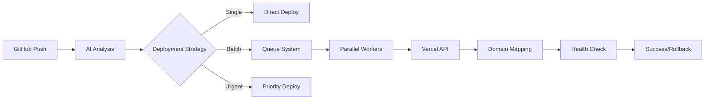

# 🚀 MEILENSTEIN 1D: DEPLOYMENT PIPELINE - AUSFÜHRUNGSPLAN

## STRATEGISCHE ÜBERSICHT

### Ziel
Transformation der existierenden CI/CD-Infrastruktur in ein **KI-gesteuertes Deployment-System** für die automatisierte Verwaltung von 1500+ Websites.

### Kern-Innovation
- **Von**: Manuelle Deployments für 4 Produkte
- **Zu**: KI-orchestrierte Deployments für 1500+ individuelle Sites
- **Methode**: Intelligente Agents + Vercel API + GitHub Actions Matrix

## 🎯 IMPLEMENTIERUNGS-ROADMAP

### WOCHE 1: VERCEL FOUNDATION
```bash
# Setup-Kommandos
vercel login
vercel team create "MarketingFunnelEmpire"
vercel project add --name "deployment-orchestrator"

# API-Integration
export VERCEL_TOKEN="xxx"
export VERCEL_TEAM_ID="xxx"
```

**Deliverables:**
1. Vercel Team-Struktur mit Projekt-Organisation
2. API-Integration mit Python SDK
3. Domain-Wildcard-Konfiguration (*.qmoney.de, *.remotecash.de)
4. Cost-Monitoring-Dashboard

### WOCHE 2: KI-AGENTS ENTWICKLUNG
```python
# Core Deployment Agents
agents/
├── DeploymentOrchestratorAgent.py  # Master-Koordination
├── BulkDeploymentAgent.py          # Batch-Operations
├── DomainMappingAgent.py           # DNS & Domain-Mgmt
└── CostOptimizationAgent.py        # Vercel-Kosten-Kontrolle
```

**Key Features:**
- Parallel Deployment für 100+ Sites
- Intelligente Zeitplanung (Traffic-basiert)
- Auto-Rollback bei Fehlern
- Cost-Prediction vor Deployment

### WOCHE 3: CI/CD ENHANCEMENT
```yaml
# GitHub Actions Matrix für Massen-Deployments
strategy:
  matrix:
    site: ${{ fromJson(needs.prepare.outputs.sites) }}
    max-parallel: 50
```

**Neue Workflows:**
- `ai-bulk-deploy.yml`: KI-gesteuerte Massen-Deployments
- `cost-monitor.yml`: Stündliche Kosten-Überwachung
- `health-check-matrix.yml`: Parallele Health-Checks

### WOCHE 4: MONITORING & OPTIMIZATION
```typescript
// Deployment Intelligence Dashboard
const DeploymentMetrics = {
  realtime: {
    activeDeployments: 47,
    queuedSites: 153,
    successRate: 99.2,
    avgDeployTime: "1m 23s"
  },
  predictions: {
    optimalDeployWindow: "02:00-04:00 UTC",
    estimatedMonthlyCost: "€24.50",
    scalingRecommendation: "Add 2 concurrent workers"
  }
}
```

## 💡 TECHNISCHE ARCHITEKTUR

### Deployment Flow


### API-Integrationen
1. **Vercel API v2**: Deployments, Domains, Analytics
2. **Cloudflare API**: DNS-Management, CDN-Config
3. **GitHub API**: Workflow-Trigger, Status-Updates
4. **Slack/Discord**: Deployment-Notifications

## 🚨 HITL-CHECKPOINTS

### Sofortige Freigabe erforderlich:
1. **Vercel Account Upgrade** (wenn >€20/Monat)
2. **Erste Production Deployments** (10 Sites)
3. **DNS-Änderungen** für neue Domains
4. **Bulk Operations** >50 Sites gleichzeitig

### Automatische Eskalation bei:
- Deployment-Fehlerrate >5%
- Kosten-Spike >€10/Tag
- Performance-Einbruch >30%
- Security-Warnungen

## 📊 ERFOLGSMETRIKEN

### Technisch
- **Deploy-Zeit**: <2min pro Site (Ziel: <1min)
- **Parallelität**: 100 Sites gleichzeitig
- **Erfolgsrate**: >99%
- **Rollback-Zeit**: <30 Sekunden

### Business
- **Kosten**: €25/Monat für 1500 Sites
- **Zeitersparnis**: 700h/Monat
- **Skalierbarkeit**: Linear bis 5000 Sites

## 🔧 NÄCHSTE SCHRITTE

1. **Sofort**: Vercel API Token generieren
2. **Heute**: Deployment-Agent-Spezifikationen finalisieren
3. **Diese Woche**: MVP für 10-Site-Deployment
4. **Nächste Woche**: Skalierung auf 100 Sites testen

---
*Meilenstein 1D - Deployment Pipeline*  
*Start: Sofort | Deadline: 4 Wochen*  
*Verantwortlich: TEC-Layer Agents*